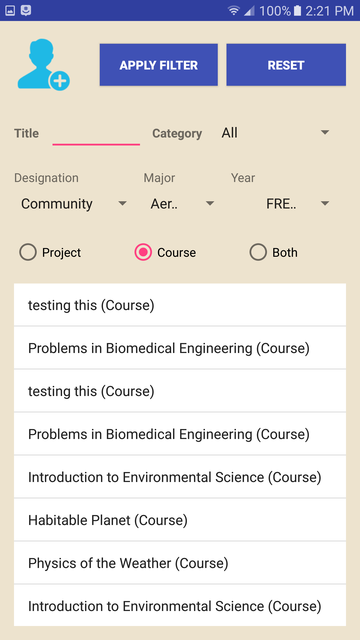
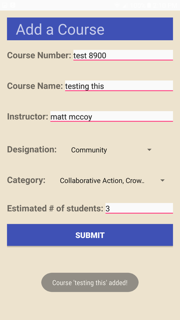

# GTSystem

Group extra credit project for cs4400 (databases) at Georgia Tech. The database was hosted on campus is has been deleted, so this will not work unless a new database is created from scratch.

Supports:
* Registration & login
* Students:
    * Searching for courses and clubs
    * applying for courses and clubs
* Professors:
    * Create new course or club
    * View applicants
    * Accept/decline applications
* Some other features, but its been too long to remember them all...

### Some Screenshots
 
